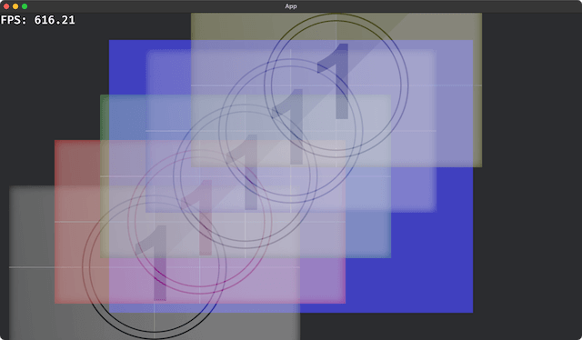

# bevy_movie_player

A movie player plugin for Bevy game engine.

**WARN** Still in development, The API may change in the future.

## Supported movie formats

- `.gv` format
    - using [rust-gv-video](https://github.com/funatsufumiya/rust-gv-video).
    - alpha channel support.
    - `.gv` has simple LZ4 compressed + BC1/BC2/BC3/BC7 texture format.
    - both disk stream and on memory stream are supported.
- Lottie (lottie-json `.json`) format (`--features lottie`)
    - using [rlottie-rs](https://github.com/msrd0/rlottie-rs)
    - supported from `0.2.1` or higher

## Version compatibility

| Bevy | bevy_movie_player |
|------|-------------------|
| 0.14 | 0.3               |
| 0.13 | 0.2               |
| 0.12 | 0.1               |

## Known issues

- Movie load FPS limitation is needed. (example code has 30fps limitation, but considering to use original thread in module)
- Very slow FPS on debug build. Please use `--release` flag to check the performance.
- Compressed Texture cannot be used on first frame, to avoid panic: `Using pixel_size for compressed textures is invalid` (`bevy_render-0.12.1/src/texture/image.rs:785:18`).
- No audio support now.

## Planning

- auto image handling / updating (just play/stop, and eliminate `update()` also?)
- Support .mp4 format. (using https://github.com/funatsufumiya/rust-mp4)
- Support other formats using `ffmpeg` or `gstreamer` as a feature. (example: 
https://gist.github.com/pkupper/108eb8a712f479ecfdb1eaf9b86cd128 )

## Contribution

- Forks and PRs are always welcome :)
